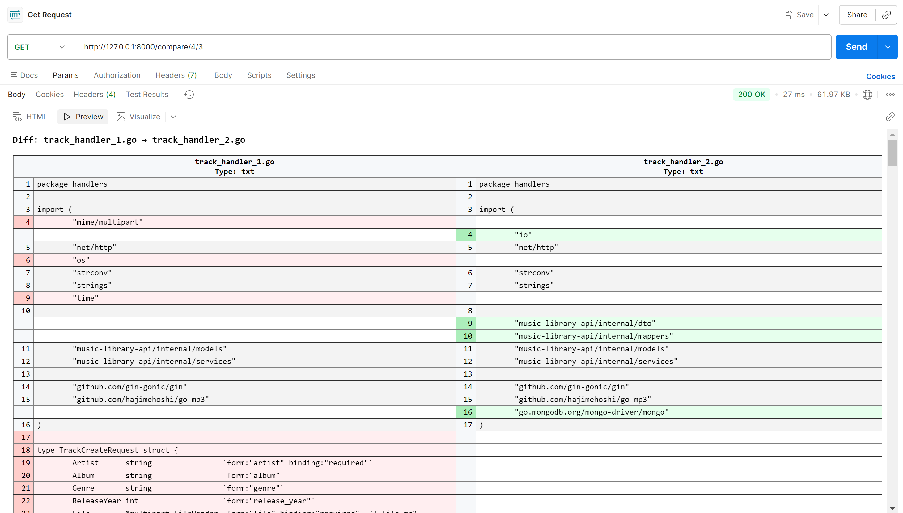

# 📝 File Compare Project

A clean architecture **File Compare Project** application built with **FastAPI** and **MySQL**.  

It supports:

- **CRUD** operations for **files**
- **GitHub-style diff** for text files, including PDF extraction
- **Simple file upload** for comparison
- **Backup and restore** for database
- **Dockerized deployment**

---

##  ▶ Demo of File Compare API



# 🚀 Run with Docker (Recommended)

#### 1️⃣ Go to project folder

```bash
cd fastapi_compare_files
```

> ⚠ **Important:** Make sure you are in the root folder of the project where
> `docker-compose.yaml` exists before running any `docker-compose` commands.

#### 2️⃣ Start Database + Backend API

```bash
docker-compose up -d
```

This will automatically:

- Start **MySQL database** (`fastapi_mysql`)  
- Build and run the **FastAPI API** (`fastapi_api`)  
- 🌐 Expose your API at: **http://localhost:8000**  
- 📘 API Documentation (Swagger UI): **http://localhost:8000/docs**  

---

# 💾 Database Backup & Restore

> ⚠ **Important:** Ensure the `data/backup/` folder exists and is correctly mounted in the database container before running any backup or restore commands.

## 📦 Backup the database

```bash
docker exec fastapi_mysql sh -c "mysqldump -uroot -pAdmin@123 file_compare_db | gzip > /backup/file_compare_db_$(date +%Y%m%d_%H%M%S).sql.gz"
```

> This will automatically create a timestamped `.sql.gz` backup in `data/backup/`.  
> Example:

```bash
./data/backup/file_compare_db_20251213_124534.sql.gz
```

## 🔄 Restore the database

Restore a specific backup file:

```bash
docker exec -i fastapi_mysql sh -c "gunzip < /backup/file_compare_db_20251213_124534.sql.gz | mysql -uroot -pAdmin@123 file_compare_db"
```

---

# 📂 File Comparison APIs

### 🔹 Compare 2 files

```http
GET /compare/{new_file_id}/{old_file_id}
```

- Returns **GitHub-style 2-column diff** in HTML
- Supports **PDF and text files**
- Shows **character-level highlighting**
- Column line numbers are visually optimized

---

# 📁 Project Structure

```
├── app/                              # FastAPI application
│   ├── api
│   │   ├── v1
│   │   │   ├── routers/              # API endpoints
│   ├── core/                         # Core settings/configs
│   ├── crud/                         # DB operations
│   ├── db/                           # SQLAlchemy models & session
│   ├── schemas/                      # Pydantic schemas
│   ├── utils/                        # Diff helpers, PDF extraction
│   ├── __init__.py
│   └── main.py                       # App entry point
├── data/
│   └── backup/                       # DB backup files
├── Dockerfile                        # Container setup
├── docker-compose.yaml               # Docker compose
├── requirements.txt                  # Python dependencies
└── .env.local                        # Environment variables
```

---

# 🧹 Cleanup Docker System

### 🛑 Stop containers

```bash
docker-compose down
```

### 🗑 Remove containers, volumes, networks

```bash
docker-compose down -v
```

```bash
docker compose down -v --rmi all --remove-orphans
```

---

# 🔧 Tech Stack

- **Python 3.10+** 🐍
- **FastAPI** ⚡ (HTTP web framework)
- **SQLAlchemy** 🗄 (ORM, supports MySQL / SQLite / PostgreSQL)
- **MySQL 8.0.44** 🐘 (Database)
- **Docker & Docker Compose** 🐳 (Containerization)
- **PDF Processing** 📄 (`PyPDF2`)
- **Diff Engine** 📝 (`difflib`, character-level highlighting)

---

# ⭐ Done! ✔

Just run `docker-compose` and everything works out of the box.  
Backup and restore scripts handle your database safely, while the API allows file comparison with GitHub-style diff.

